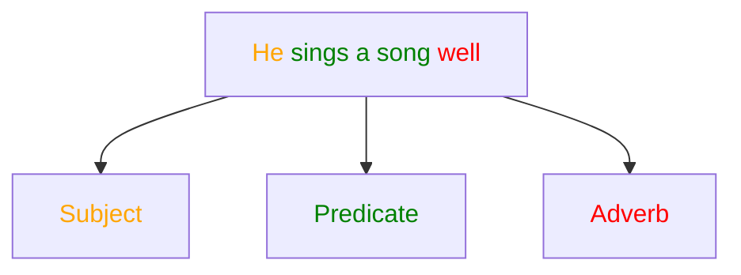

# Letter
Vowel = a, e, i, o, u
Special Vowel = y
# Word
- Derivatives = Noun-Verb-Adjective-Adverb
- Example= Beauty-Beautify-Beautiful-Beautifully
# Parts of speech
1. Noun
2. Pronoun
3. Adjective
4. Verb
5. Adverb
6. Preposition
7. Conjunction
8. Interjection 
# Sentence
Word + Word = Sentence
- Types of Sentences = 5 (BD)
    1. Assertive/Declarative(sub+verb+ext+fullstop): She went to the market.
    2. Imperative/Question(Verb/Let/Please/Kindly…): Sleep on the floor. (no subject)
    3. Interrogative/Command(…?): Does he like you?
    4. OptativeX(May/Long…): May Allah help you.
    5. Exclamatory(…!…): Hurrah! I have won the game.
- Types of Sentences = 4 (Natives) -Optative
    1. Assertive/Declarative(sub+verb+ext+fullstop): She went to the market.
    2. Imperative/Question(Verb/Let/Please/Kindly…): Sleep on the floor. (no subject)
    3. Interrogative/Command(…?): Does he like you?
    4. Exclamatory(…!…): Hurrah! I have won the game.
- According to the structure(sentence):
    1. Simple
    2. Complex
    3. Compound
# Types of Sentences. BD `d4-5`

## 1. Assertive
### Structure:

1. Subject + verb + extension/object + full stop
2. There + verb + subject (noun/noun phrase) + extension + full stop
### Examples:

- Rita walks very fast.
- He can read her mind.
- Hog-Plum tastes sour.
- There is a post office in this village.

---

## 2. Interrogative

### Structure:

1. Wh. word/auxiliary verb + subject…?
    - Wh. word = What/Who/When/How/Which
    - Auxiliary verb = Do/does/did/have/has, etc.

### Examples:

- What did they think?
- Who are you?
- Does he act like him?
- Have you bought Pomfret?

---

## 3. Imperative

Without subject = Imperative

The subject is hidden and is always you.

### Structure:

1. Verb + extension + full stop
2. Please/Kindly + verb + full stop
3. Do not/ Never + verb + full stop
4. Let + me/us

### Examples:

- Get out.
- hidden subject You get out.
- Be serious in your activities.
- Please shut the door.
- Do not close your eyes.
- Never say it again.

---

## 4. Optative

### Structure:

1. May/Long + assertive sentence
2. Have(wish) + assertive sentence

### Examples:

- May you be happy in your life.
- May I get the chance again.
    - May = adverb
- May I get the chance again?
    - May = modal verb

## 5. Exclamatory

### Structure:

1. Hurrah!, Alas!, Fie!, Hush!+subject+verb+extension.
2. What+a/an+…!
3. How+adjective…!
4. Subject+verb+so(adverb)+adjective!
5. Subject+verb+such+a/an+adjective+noun!

### Examples:

- Hurrah! I have got my lost phone.
- What a nice yarn it is!
    - yarn = story
    - What+a/an…!
        - What a method it is!
    - How+x…!
        - How x funny it is
- How odd it was!
- I am so worried now!
    - …so…!
    - I am so happy that I can not express in a word.
        - so…that…fullstop
- This is so amazing!
- He is such a kind person!

# Subject & Predicate `d6`

# Object

When we question a verb with what or whom, the answer is the object.
- He eats rice.
- He plays football.
- They gave me a flower vase. 
# Kinds of objects
1. Indirect object
	- Our teacher helped **us**.
	- The police told **me** the real story.
2. Direct object
	- He gave **shelter**.
	- I sing a **song**.
	- She speaks **English**.
	- The police told me **the real story**.

#### If 2 indirect object are in the same sentence.
- Indirect object + Direct object
- Direct object + preposition(to/for) + Indirect object

Example:
She sent **me** an **e-mail**.
She sent an **e-mail** for **me**.
# Complements
# Kinds of complements:
1. Subjective complement
	1. Noun complement
	2. Adjective complement
2. Objective complement

# Gender
# Kinds of Genders:
1. Masculine Genders
2. Feminine Genders
3. Common Genders
4. Neuter Genders

#### MCQ: What is the plural of "It"?
Ans: They
Reason: 
A pen is unique. It is mine/my pen.
The pens are unique. They are mine.
Mango=It
Mangoes=They

# Number & Person

## Kinds of Numbers
1. Singular numbers
2. Plural number
