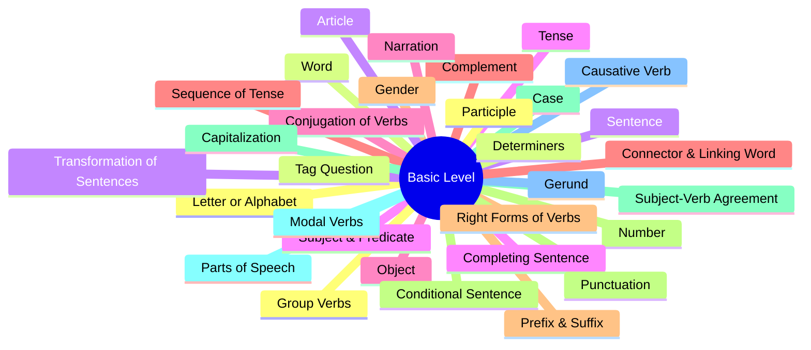

## NEED: Basic English Grammar Basic to Advance

### I. Basic Level

**1. Letter or Alphabet (Page 31):**

- Vowel and Consonant: The basic concept.
- 26 Letters: Bengali pronunciation.
- English Pangram: Definition and purpose.

**2. Word (Page 33):**

- Big Word: Concept.
- Derivatives: Definition.
- Fill in the Gap.
- American Words Vs British Words: Important words listed.

**3. American Words Vs British Words (Page 35)**

**4. Sentence (Page 38):**

- Kinds of Sentences: Assertive/Declarative, Interrogative/Question, Imperative/Command, Optative, Exclamatory.
- Detailed study of the five kinds of sentences.
- Interjection vs Exclamatory Sentence.

**5. Subject & Predicate (Page 43):**

- Sentence's main parts.
- Types of Subject (e.g., single subject, subject with modifier, compound subject).
- Types of Predicate (e.g., one verb, two verbs, compound predicate).
- Practice: MCQ with correct answers and explanations.

**6. Object (Page 46):**

- Kinds of Objects: Indirect Object (I.O.) and Direct Object (D.O.).
- Direct Object & Indirect Object: Explanation and practice.

**7. Complement (Page 48):**

- Kinds of Complements: Subjective, Objective, Noun, Adjective, Adverb Complement.
- Complement defined by Linking Verb.
- Object & Complement: Comparative analysis.
- Practice: MCQ with correct answers and explanations.

**8. Gender (Page 53):**

- Kinds of Genders: Masculine, Feminine, Common, Neuter.
- Rules for converting Masculine to Feminine.
- Practice: MCQ with correct answers and explanations.

**9. Number (Page 60):**

- Kinds of Numbers: Singular and Plural.
- Rules for forming Plural from Singular Noun.
- Comparison of Old English and Modern English plural forms.
- Nouns that are always Singular or Plural.
- Nouns having the same Singular and Plural forms.
- Practice: MCQ with correct answers and explanations.

**10. Case (Page 68):**

- Kinds of Cases: Subjective Case (Nominative Case), Objective Case (Accusative Case), Possessive Case (Genitive Case), Vocative Case.
- A table showing the 5 types of Case.
- Practice: MCQ with correct answers and explanations.

**11. Parts of Speech (Page 72):**

- **Noun:** Proper, Common, Collective, Material, Abstract Noun.
    - Countable & Uncountable Noun, Partitive Phrase.
- **Pronoun:** Personal, Possessive, Reflexive/Emphatic, Interrogative, Relative, Reciprocal, Demonstrative, Indefinite, Distributive.
- **Adjective:** Determiners (Article, Demonstrative, Possessive, Quantifier, Numbers, Indefinite, Interrogative).
    - Types include Proper, Hyphen, and Participle Adjective, and the Order of Adjectives.
- **Verb:** Finite and Non-finite Verb.
    - Principal/Main Verb, Auxiliary/Helping Verb.
    - Transitive and Intransitive Verb (including usage interchangeably).
    - Factitive Verb, Cognate Verb, Quasi-passive Verb, Reflexive Verb, Group Verb, Impersonal/Weather Verb.
- **Adverb:** Types (Manner, Place, Time, Frequency/Duration, Degree/Comparison, Purpose/Reason).
    - Preposition when Adverb, Enough as Adverb/Adjective, Position of Adverb.
- **Preposition:** Dictionary, Types (Simple, Double, Compound, Participle), Appropriate Prepositions (360 entries).
    - Collocation with Prepositions and Prepositions in Pictures.
    - Practice: Levels 1, 2, 3, and MCQ.
- **Conjunction:** Co-ordinate (Single, Pair) and Sub-ordinate Conjunction.
    - Conjunction when Preposition.
- **Interjection:** Exclamation types (Surprise, Disgust, Joy, Excitement).

**12. Causative Verb (Page 181):**

- Types: Indigenous and Non-indigenous causative verbs.
- Usage of Make, Get, Have, Let, and Help as causative verbs.
- Causative Verb Shortcuts.
- Practice: MCQ.

**13. Group Verbs (Page 187):**

- Usage and definition of Group Verbs (e.g., Act, Bear, Blow, Break, Bring, Call, Look, Turn, etc.).

**14. Determiners (Page 206):**

- Determiner definition and types (e.g., Article, Possessive, Numbers).
- Order of Determiners.
- Countable, Uncountable, and Mixed Determiners.
- Use of specific Determiners (A, An, One; Every, Both, These, Those; Few/Little families; Much/Many families; All, Some, None).

**15. Article (Page 218):**

- Indefinite and Definite Article, Origin, Use, and Omission of Articles.
- Repetition of Articles.

**16. Tense (Page 242):**

- Origin, Types (Present, Past, Future), and the 12 Tenses.

**17. Conjugation of Verbs (Page 267):**

- Strong Verbs, Weak Verbs, Conjugation Lists (100 Basic and 365 Advanced).

**18. Sequence of Tense (Page 298):**

- Rules and Exceptions.

**19. Right Forms of Verbs (Page 302):**

- Usage of V1, V-s/es, V-ing, V-to, V2, V3, and Exclusive Mixed Rules.

**20. Conditional Sentence (Page 327):**

- Kinds: Zero, First, Second, Third Conditional.
- Usage of Unless, Had, and In case.

**21. Subject-Verb Agreement (Page 333):**

- Core principles, phases, and conditions for Singular/Plural status.

**22. Modal Verbs (Page 344):**

- Usage of all major modals (Can, Could, May, Might, Shall, Will, Should, Ought to, Would, Must, Have to, Used to, Need, Dare, Be to, Be going to).
- Confusion between Modal Verb and Continuous Tense, Semi-Modal Verbs.

**23. Gerund (Page 359):**

- Position and comparison with Participle.

**24. Participle (Page 362):**

- Kinds: Past, Perfect, Present Participle.
- Gerund & Participle comparison.

**25. Tag Question (Page 367):**

- Basic information, structure, rules, and contracted forms.

**26. Transformation of Sentences (Page 381):**

- **Changing Sentences:** Conversions between Assertive, Affirmative, Negative, Interrogative, Imperative, Optative, and Exclamatory sentences.
- **Voice Changing:** Active/Passive Voice, Tense-based rules, Interrogative and Imperative shortcuts.
- **Simple - Complex - Compound:** Conversion methods and shortcuts (Vice-Versa).
- **Degree Changing:** Positive, Comparative, and Superlative degrees (Structure and Conversion).

**27. Completing Sentence (Page 451):**

- Comprehensive list of sentence structures and connecting words (e.g., So that, Lest, Relative pronoun, Unless, No sooner had).

**28. Narration (Page 468):**

- Direct and Indirect Narration, Conversion rules (Reporting Verb, Person, Tense, Adverbs, Passage Narration).

**29. Connector & Linking Word (Page 490):**

- Traditional grammar vs contemporary view, types of connectors (e.g., Additive, Adverse, Cause/Effect, Purpose).

**30. Prefix & Suffix (Page 502):**

- Definitions and rules.

**31. Punctuation (Page 525):**

- Rules for 12 punctuation marks (e.g., Full stop, Comma, Exclamation Mark, Asterisk).

**32. Capitalization (Page 543):**

- Rules for using capital letters.

---

### II. Advanced Level

**33. Clause & Its Details (Page 549):**

- Kinds of Clauses: Principal/Independent, Co-ordinate, Sub-ordinate/Dependent (Noun, Adjective, Adverb).

**34. Phrase and Its Details (Page 561):**

- Definition and fundamental rules.
- Kinds of Phrases (e.g., Noun, Verb, Prepositional, Infinitive, Participle).
- Phrase vs Idiom comparison.

**35. Framing Questions/WH. Question Making (Page 577):**

- Use of various WH-words (Who, Whom, Which, What, When, Where, Why, How).

**36. Affirmative & Negative Agreement (Page 594):**

- Definitions and rules for agreement.

**37. Degree of Comparison (Page 598):**

- Detailed rules, Latin Comparatives, Superlative forms.

**38. Parallelism (Page 603):**

- Definition and measurement rules.

**39. Redundancy (Page 607):**

- Discussion and avoidance of redundant expressions, excessive prepositions, and unnecessary phrases.

**40. Embedded Question (Page 613):**

- Definition, structure, and shortcuts.

**41. Dangling Modifier (Page 617):**

- Basic information, types, and identification.

**42. Inversion of Verbs (Page 622):**

- Rules for inversion, including Negative Adverb, Introductory Here/There, and Conditional statements.

**43. Subjunctive (Page 626):**

- Usage with Verb, Adjective, Noun, and Pronoun.
- British English vs American English usage.

**44. Run on Sentence (Page 629):**

- Definition and associated problems.

**45. Common Mistakes in English (Page 630):**

- Detailed list of commonly confused word pairs (e.g., Good Vs Well, Many Vs Much, Economic Vs Economical).

**46. Pair of Words (Page 656)**

**47. The Same Word Used as Different Parts of Speech (Page 662)**

**48. Sentence Completion/Filling in the Gap (Page 672)**

**49. Sentence Correction (Page 681)**

**50. Idiom & Phrase (Page 708):**

- 200 Common Idioms & Phrases.
- 500 Most Important Idioms and Phrases.

**51. Basic Sentence Structures (Page 726)**

**52. Essential Translations (Page 737)**

**53. Proverbs (Page 749)**

---

### III. Writing Part

**54. Paragraph Writing (Page 755)** **55. Letter Writing (Page 756)** **56. Application Writing (Page 758)** **57. Report Writing (Page 759)** **58. Précis Writing (Page 760)** **59. Memorandum Writing (Page 760)** **60. E-mail Writing (Page 761)** **61. Completing Story (Page 762)** **62. Graph & Chart (Page 763)** **63. CV Writing (Page 764)** **64. Dialogue Writing (Page 766)** **65. Essay Vs Composition (Page 767)**

---

### IV. Solutions

- Solution of Practice: Level- 1, 2, 3 (Pages 771-798).